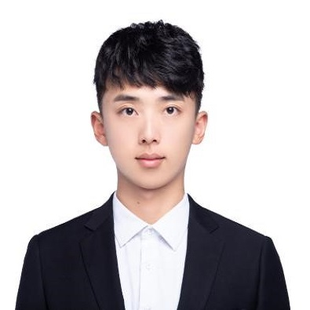



Research Students
======
* Mr. **Tianyu ZHENG** (SEU), PhD student, 2022
  * *k*-out-of-*N* proofs, RingCT protocols
  
* Miss **Xun LIU** (UCAS), PhD student, 2022
  * zk-SNARKs

* Miss **Xue CHEN** (NCUT), MPhil student, 2022
  * Signatures

Research Staffs
======
* Mr. **Chengpeng HUANG** (JNU), research assistant, 2022
  * zk-Rollups
  
<!--
Alumni
======
* Miss **Yuxi XUE** (HKU), research assistant, 2021
  * Sigma protocol

  
  Quan Chen

Research Students
======

Research Staffs
======
* **Microsoft**, China, 2019-2020: 
  * Software engineer

* **The Hong Kong Polytechnic University**, Hong Kong SAR, 2020-current: 
  * Research assistant professor

Former Students and RAs
======
-->